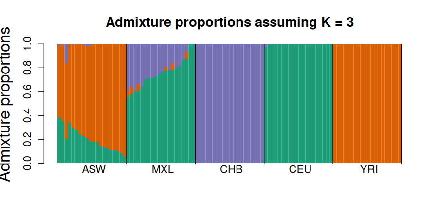
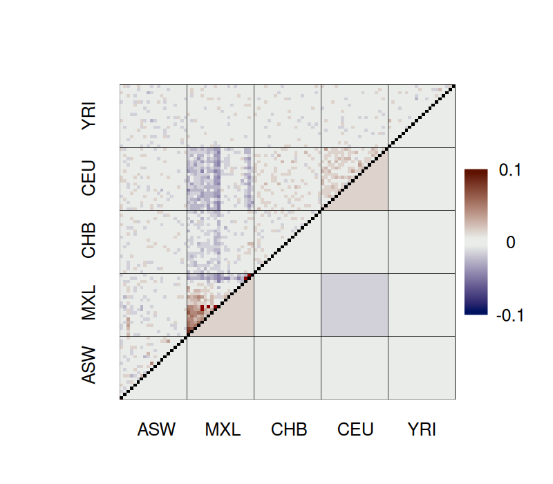

# admixer

Fast maximum-likelihood estimation of ancestry proportions (Q) and ancestral allele frequencies (P) from

* **called genotypes** (PLINK `.bed`), under the ADMIXTURE model, with ADMIXTURE's command line, input and
  output; or
* **genotype likelihoods** (beagle files, as written by ANGSD), under the NGSadmix model, for
  low-depth sequencing data.

Both use ADMIXTURE's optimisation algorithm: block relaxation with Newton steps and quasi-Newton
acceleration, evaluated with BLAS matrix products. For genotype likelihoods, the Newton steps use the exact
curvature of the likelihood.
* **Genotypes:** it reaches the same likelihood as ADMIXTURE 1.3.0 and was 90–116× faster in our benchmarks
  (20,000 SNPs, 2,000 individuals, K = 5–20, 8 threads; 127–235× with 64 threads).
* **Genotype likelihoods:** on the NGSadmix tutorial data, it reached the best solution 15–118× faster than
  NGSadmix 32 (K = 3–6), and from more random starts.

Details beyond everyday use (algorithms, performance, testing, differences from ADMIXTURE and NGSadmix) are in
[DETAILS.md](DETAILS.md).

## Install

### Prebuilt binary (Linux x86_64)

Nothing else needs to be installed: OpenBLAS, zlib and the C++/OpenMP runtimes are built in. It runs on any
x86_64 Linux with glibc 2.28 or newer (RHEL/Rocky/Alma 8+, Ubuntu 20.04+, Debian 10+), and uses AVX-512
when the CPU has it.

```
wget https://github.com/aalbrechtsen/admixer/releases/latest/download/admixer-linux-x86_64.tar.gz
tar xzf admixer-linux-x86_64.tar.gz
./admixer
```

### From source

Requires a C++17 compiler with OpenMP (e.g. g++), OpenBLAS and zlib. On Ubuntu/Debian:

```
sudo apt-get install build-essential libopenblas-dev zlib1g-dev
git clone https://github.com/aalbrechtsen/admixer.git
cd admixer
make
make test        # optional: the test suite, about 15 seconds (see DETAILS.md)
```

<details>
<summary>On a cluster with environment modules (<code>module load</code>)</summary>

Load a compiler and OpenBLAS before running `make` (`module avail gcc openblas` lists what is installed):

```
git clone https://github.com/aalbrechtsen/admixer.git
cd admixer
module load gcc openblas
make
```

If `make` stops with `cblas.h: No such file or directory`, OpenBLAS is not loaded; with
`zlib.h: No such file or directory`, also run `module load zlib`. The binary links OpenBLAS from the module,
so run `module load openblas` before using it (otherwise it fails with `error while loading shared
libraries: libopenblas.so.0`), or use the prebuilt binary above, which needs no modules.

</details>

This builds the `admixer` binary in the current directory. `sudo make install` copies it to
`/usr/local/bin` (or `make install PREFIX=$HOME/.local`). To link a different BLAS, use for example
`make BLAS=-lblis`. The prebuilt binary is made with `./build-static.sh` (see DETAILS.md).

## Usage

```
admixer [options] data.bed K            # called genotypes: data.bed, data.bim, data.fam
admixer [options] data.beagle.gz K      # genotype likelihoods (any input not ending in .bed)
```

The output is written to the working directory, in ADMIXTURE's format, with the input name without its
extension (`data`) as prefix:

* `data.K.Q`: admixture proportions, one row per individual;
* `data.K.P.gz`: ancestral allele frequencies, one row per SNP (gzip-compressed; `--no-gzip` for `data.K.P`).
  For beagle input, the rows are the sites that pass the filters, in input order;
* `data.K.corres.txt`: the evalAdmix correlation of residuals between individuals (corrected estimator; for
  genotype likelihoods on the posterior expected genotypes), for checking the model fit; plot it with evalAdmix's `visFuns.R`. It takes a few seconds for
  thousands of individuals but needs about 48 N² bytes of memory, so it is skipped above 20,000 individuals
  unless `--evaladmix` is given;
* `data.K.log`: the log printed to the screen (command line, progress, final log-likelihood, optimality check).

| option | meaning |
|---|---|
| `-jX`, `-j X` | number of threads (default 8) |
| `--seed=X`, `-s X` | random seed (default 43; `time` uses the clock) |
| `-C=X`, `-C X` | stop when the log-likelihood improves by less than X (default 1e-4) |
| `-o NAME` | output prefix `NAME` instead of `data` |
| `--no-gzip` | write the P matrix uncompressed (`NAME.K.P`) |
| `--supervised` | supervised analysis; reads `data.pop` (one line per individual: a population name, or `-` if unknown). Labelled individuals are held at their population; K must equal the number of population names, and columns follow the order of first appearance in `data.pop` |
| `-P` | projection; reads `data.K.P.in` (or `data.K.P.in.gz`) and estimates Q with P held fixed |
| `--conv X` | convergence test with several starts (see below): stop when X runs agree with the best run |
| `-m X`, `--max_runs=X` | with `--conv`: at most X runs (default 10) |
| `--conv_thres=X` | with `--conv`: runs agree if the largest difference in any Q entry is below X (default 0.01) |
| `--no-evaladmix` | do not compute the evalAdmix correlation of residuals |
| `--evaladmix` | compute it even for more than 20,000 individuals |
| `--minMaf=X` | beagle input: keep sites with X < MAF < 1 − X (default 0.05, as NGSadmix; 0 keeps all) |
| `--misTol=X` | beagle input: GLs with max − min < X count as missing (default 0.05, as NGSadmix) |
| `--minInd=X` | beagle input: keep sites with more than X individuals with data (default 0 = off) |
| `--keep-missing` | beagle input: use the missing GL entries as data (as NGSadmix's EM) instead of leaving them out |

Advanced options for benchmarking (`--bound`, `--prime`, `--minibatch`, `--hess`, `--max-iter`): see
[DETAILS.md](DETAILS.md#advanced-options).

Examples: `admixer -j16 data.bed 5`, `admixer -j16 input.beagle.gz 3`

### Convergence test with several starts

Hard data sets can have several local optima, so one run may not find the best solution. `--conv X` runs
admixer with consecutive seeds (`--seed`, `--seed`+1, ...), reading the data only once, until X runs agree with
the best run (largest difference in any Q entry below `--conv_thres`, after matching the ancestries), or at
most `--max_runs` runs. The output files are those of the best run, and `data.K.conv` lists every run. Details:
[DETAILS.md](DETAILS.md#convergence-test---conv).

Example: `admixer --seed=30 --conv 3 data.bed 8` uses seeds 30, 31, 32, ... until 3 runs agree
(at most 10 runs).

## How it works

* **Called genotypes:** ADMIXTURE's model and algorithm. From a random P and near-uniform Q, it takes 5 EM steps,
  then a mini-batch warm-up on SNP batches. Then it runs block relaxation with one Newton/QP step per row of P
  and of Q, accelerated by quasi-Newton extrapolation. ADMIXTURE's bounds and stopping rule apply.
* **Genotype likelihoods:** NGSadmix's model, with the same block relaxation, using the exact curvature in the
  Newton steps. NGSadmix's filters and bounds apply, and missing GLs are left out.
* **Implementation:** every pass works on tiles of SNPs × individuals with BLAS matrix products and vectorised
  per-entry kernels, in parallel on OpenMP threads. The same seed and number of threads give identical results.
* The log ends with an optimality check (the largest projected-gradient step; 0 at a local optimum).

Details: [DETAILS.md](DETAILS.md) (algorithms, performance, testing, and the differences from ADMIXTURE and NGSadmix).

## Example: blue wildebeest (PLINK), K = 7

This example follows the popgenDK exercise
[Admixture proportions from called genotypes: blue wildebeest](https://github.com/popgenDK/courses/blob/main/current_exercises/admixture/admixture_called_genotypes_animal.ipynb).

**The data.** 73 blue wildebeest from seven sampling localities; the locality is the first column of the
`.fam` file.

**How the input was made.** The input `blue_wildebeest_noLD` is made in the exercise from 990,980 called SNPs
(`blue_wildebeest_thin`). The SNPs are LD-pruned with PCAone, which corrects for population structure:

```
PCAone -b blue_wildebeest_thin -k 6 -D -o pcaone
PCAone -B pcaone.residuals -F pcaone.mbim --ld-r2 0.1 --ld-bp 1000000 -o pcaone
plink --bfile blue_wildebeest_thin --extract pcaone.ld.prune.in --make-bed --out blue_wildebeest_noLD --chr-set 29
```

This leaves 37,567 SNPs. The data are not included in this repository.

### One run

```
admixer --seed 1 -j10 -o blue_wildebeest_noLD_admixer blue_wildebeest_noLD.bed 7
```

<details>
<summary>Full screen output = log file <code>blue_wildebeest_noLD_admixer.7.log</code> (click to expand)</summary>

```
admixer 0.2.1
Command: admixer --seed 1 -j10 -o blue_wildebeest_noLD_admixer blue_wildebeest_noLD.bed 7
Random seed: 1
Point estimation method: Block relaxation algorithm (Newton/QP steps, BLAS kernels)
Convergence acceleration algorithm: QuasiNewton, 3 secant conditions
Point estimation will terminate when objective function delta < 0.0001
Size of G: 73x37567
Threads: 10
Performing 5 EM steps to prime main algorithm
1 (EM) 	Elapsed: 0.012	Loglikelihood: -3905731.572719	(delta): inf
2 (EM) 	Elapsed: 0.018	Loglikelihood: -3589909.043398	(delta): 315823
3 (EM) 	Elapsed: 0.024	Loglikelihood: -3575200.604387	(delta): 14708.4
4 (EM) 	Elapsed: 0.029	Loglikelihood: -3574247.667174	(delta): 952.937
5 (EM) 	Elapsed: 0.035	Loglikelihood: -3574138.765123	(delta): 108.902
Initial loglikelihood: -3574096.334450
1 (mini-batch, 32 batches) 	Elapsed: 0.084	Loglikelihood: -3305128.521987	(delta): 268968
2 (mini-batch, 32 batches) 	Elapsed: 0.111	Loglikelihood: -3093758.676563	(delta): 211370
3 (mini-batch, 32 batches) 	Elapsed: 0.137	Loglikelihood: -3020493.145225	(delta): 73265.5
4 (mini-batch, 32 batches) 	Elapsed: 0.163	Loglikelihood: -3005025.468831	(delta): 15467.7
5 (mini-batch, 32 batches) 	Elapsed: 0.189	Loglikelihood: -2983492.604491	(delta): 21532.9
6 (mini-batch, 32 batches) 	Elapsed: 0.214	Loglikelihood: -2970637.518148	(delta): 12855.1
7 (mini-batch, 32 batches) 	Elapsed: 0.240	Loglikelihood: -2963043.082622	(delta): 7594.44
8 (mini-batch, 32 batches) 	Elapsed: 0.266	Loglikelihood: -2955627.401658	(delta): 7415.68
9 (mini-batch, 32 batches) 	Elapsed: 0.292	Loglikelihood: -2949074.319863	(delta): 6553.08
10 (mini-batch, 32 batches) 	Elapsed: 0.317	Loglikelihood: -2945153.291846	(delta): 3921.03
11 (mini-batch, 32 batches) 	Elapsed: 0.343	Loglikelihood: -2941630.583136	(delta): 3522.71
12 (mini-batch, 32 batches) 	Elapsed: 0.369	Loglikelihood: -2940097.110485	(delta): 1533.47
13 (mini-batch, 32 batches) 	Elapsed: 0.394	Loglikelihood: -2937886.236819	(delta): 2210.87
14 (mini-batch, 32 batches) 	Elapsed: 0.420	Loglikelihood: -2936857.473170	(delta): 1028.76
15 (mini-batch, 32 batches) 	Elapsed: 0.446	Loglikelihood: -2936705.528621	(delta): 151.945
16 (mini-batch, 32 batches) 	Elapsed: 0.471	Loglikelihood: -2936839.315746	(delta): -133.787
17 (mini-batch, 16 batches) 	Elapsed: 0.493	Loglikelihood: -2934505.434621	(delta): 2333.88
18 (mini-batch, 16 batches) 	Elapsed: 0.514	Loglikelihood: -2934593.456456	(delta): -88.0218
19 (mini-batch, 8 batches) 	Elapsed: 0.533	Loglikelihood: -2933738.627439	(delta): 854.829
20 (mini-batch, 8 batches) 	Elapsed: 0.553	Loglikelihood: -2933552.673173	(delta): 185.954
21 (mini-batch, 8 batches) 	Elapsed: 0.572	Loglikelihood: -2933570.207691	(delta): -17.5345
22 (mini-batch, 4 batches) 	Elapsed: 0.590	Loglikelihood: -2933229.690094	(delta): 340.518
23 (mini-batch, 4 batches) 	Elapsed: 0.608	Loglikelihood: -2933135.647354	(delta): 94.0427
24 (mini-batch, 4 batches) 	Elapsed: 0.627	Loglikelihood: -2933145.977744	(delta): -10.3304
25 (mini-batch, 2 batches) 	Elapsed: 0.644	Loglikelihood: -2933015.506707	(delta): 130.471
26 (mini-batch, 2 batches) 	Elapsed: 0.661	Loglikelihood: -2933009.051346	(delta): 6.45536
27 (mini-batch, 2 batches) 	Elapsed: 0.678	Loglikelihood: -2933005.262884	(delta): 3.78846
28 (mini-batch, 2 batches) 	Elapsed: 0.696	Loglikelihood: -2933001.307338	(delta): 3.95555
29 (mini-batch, 2 batches) 	Elapsed: 0.713	Loglikelihood: -2933000.262047	(delta): 1.04529
30 (mini-batch, 2 batches) 	Elapsed: 0.730	Loglikelihood: -2932999.566725	(delta): 0.695322
31 (mini-batch, 2 batches) 	Elapsed: 0.747	Loglikelihood: -2932999.375594	(delta): 0.191131
32 (mini-batch, 2 batches) 	Elapsed: 0.764	Loglikelihood: -2932998.737526	(delta): 0.638068
33 (mini-batch, 2 batches) 	Elapsed: 0.781	Loglikelihood: -2932998.786367	(delta): -0.0488406
Starting main algorithm
1 (QN/Block) 	Elapsed: 0.828	Loglikelihood: -2932965.459753	(delta): inf
2 (QN/Block) 	Elapsed: 0.860	Loglikelihood: -2932963.623793	(delta): 1.83596
3 (QN/Block) 	Elapsed: 0.893	Loglikelihood: -2932963.275774	(delta): 0.348019
4 (QN/Block) 	Elapsed: 0.932	Loglikelihood: -2932963.129045	(delta): 0.146729
5 (QN/Block) 	Elapsed: 0.976	Loglikelihood: -2932963.106727	(delta): 0.0223178
6 (QN/Block) 	Elapsed: 1.011	Loglikelihood: -2932963.079817	(delta): 0.0269099
7 (QN/Block) 	Elapsed: 1.043	Loglikelihood: -2932963.073994	(delta): 0.005823
8 (QN/Block) 	Elapsed: 1.075	Loglikelihood: -2932963.071934	(delta): 0.00205984
9 (QN/Block) 	Elapsed: 1.109	Loglikelihood: -2932963.070470	(delta): 0.00146464
10 (QN/Block) 	Elapsed: 1.141	Loglikelihood: -2932963.069341	(delta): 0.00112899
11 (QN/Block) 	Elapsed: 1.173	Loglikelihood: -2932963.069302	(delta): 3.84306e-05
Summary: 
Converged in 11 iterations (1.230 sec)
Loglikelihood: -2932963.069302
Optimality check (max projected gradient): P 7.78e-05, Q 2.34e-08
Writing output files.
evalAdmix correlation of residuals written to blue_wildebeest_noLD_admixer.7.corres.txt (0.08 sec)
Log written to blue_wildebeest_noLD_admixer.7.log
```

</details>

This run takes 1.2 seconds and ends at log-likelihood −2932963.07. It writes these files:

| file | size | content |
|---|---|---|
| `blue_wildebeest_noLD_admixer.7.Q` | 4.5 kB | admixture proportions, 73 rows × 7 columns (as ADMIXTURE) |
| `blue_wildebeest_noLD_admixer.7.P.gz` | 0.9 MB | ancestral allele frequencies, 37,567 rows × 7 columns, gzipped (`--no-gzip` for plain text) |
| `blue_wildebeest_noLD_admixer.7.corres.txt` | 50 kB | **evalAdmix correlation of residuals**, 73 × 73, `NA` on the diagonal |
| `blue_wildebeest_noLD_admixer.7.log` | 5 kB | the screen output: command, settings, every iteration, final log-likelihood, optimality check |

The evalAdmix correlations are computed by default, in 0.1 s here. You do not need to run evalAdmix
separately; the file is read directly by evalAdmix's `plotCorRes` (see below).


The fit looks wrong:
- the W-Serengeti samples are split between two clusters;
- the three C-Luangwa samples all appear admixed in the same proportions.

The evalAdmix correlation of residuals (`blue_wildebeest_noLD_admixer.7.corres.txt`, written by default)
confirms it. There are strong positive correlations within C-Luangwa and N-Selous, and negative correlations
between them and B-Ethosha.


### Several runs with a convergence test

```
admixer --seed 0 -j10 -o blue_wildebeest_noLD_admixerMult blue_wildebeest_noLD.bed 7 --conv 3
```

This tries seeds 0, 1, 2, ... until three runs agree with the best run, in 11 seconds.
`blue_wildebeest_noLD_admixerMult.7.conv` lists the runs, best first:

```
run  seed  loglik           loglik_diff    max_abs_dQ   ...  agrees
9    8     -2906767.495807   0.000000      0                 1
1    0     -2906767.495808  -0.000001      9.53674e-07       1
6    5     -2906767.495820  -0.000013      2.5034e-05        1
8    7     -2932625.706040  -25858.210232  0.99993           0
2    1     -2932817.816830  -26050.321022  0.99993           0
...
```

Three of the nine runs reach the same solution, which is 26,000 log-likelihood units better than the seed-1
run. The output files are those of the best run (seed 8):
- `blue_wildebeest_noLD_admixerMult.7.Q`, `.7.P.gz` and `.7.corres.txt` (evalAdmix computed for the best run);
- `.7.log`, with one summary line per run;
- `blue_wildebeest_noLD_admixerMult.7.conv`, the table above.


Each locality now has its own ancestry, and the residual correlations are close to zero.


The plots were made with evalAdmix's [`visFuns.R`](https://github.com/GenisGE/evalAdmix); the code is in
[DETAILS.md](DETAILS.md#plotting-the-example-figures).

### Comparison with ADMIXTURE

Ten runs of each program on the same data (seeds 1–10, K = 7, 8 threads, one run at a time). The
log-likelihoods are from admixer 0.1.0, which gives the same results as the current version; the times are
from the current version (October 2026, with the faster per-entry kernels):

```
admixture -j8 -s $seed blue_wildebeest_noLD.bed 7
admixer -j8 -s $seed blue_wildebeest_noLD.bed 7
```

<p float="left">
  
  
</p>

Both programs reach the best likelihood in 5 of the 10 runs. The other runs end in local optima 10,000–27,000
units lower. Over 30 seeds the counts were 18/30 for admixer and 13/30 for ADMIXTURE.

The best runs agree:
- admixer: −2906767.4958 to −2906767.4958;
- ADMIXTURE: −2906767.503 to −2906767.656.

ADMIXTURE's runs are a little lower because its stopping rule ends them slightly before the optimum.

The median time per run was 1.7 s for admixer and 53 s for ADMIXTURE, 32× faster (admixer 0.1.0 took 3.2 s).
So `--conv 3` with admixer (11 s above) takes much less time than a single ADMIXTURE run.

## Example: genotype likelihoods, NGSadmix tutorial data, K = 3

The NGSadmix tutorial file `input.gz` holds beagle GLs for 100 HapMap individuals (ASW, CEU, CHB, MXL, YRI)
at 50,000 sites.

```
admixer --seed 1 -j10 input.gz 3
```

The MAF filter keeps 49,475 sites, and 3.3 % of the GL entries are missing. The end of the log:

```
26 (QN/Block) 	Elapsed: 1.003	Loglikelihood: -3865964.313412	(delta): 4.2554e-05
Summary: 
Converged in 26 iterations (1.910 sec)
Loglikelihood: -3865964.313412
Loglikelihood over all GL entries, missing ones included (as NGSadmix): -3865964.313412
Optimality check (max projected gradient): P 4.45e-05, Q 2.76e-11
Writing output files.
evalAdmix correlation of residuals written to input.3.corres.txt (0.31 sec)
Log written to input.3.log
```

With 8 threads, NGSadmix 32 (`NGSadmix -likes input.gz -K 3 -P 8 -seed 1`) needs 205 iterations and 15 s on
the same data. It stops at −3865964.43, 0.12 below the optimum.

In a benchmark with 25 random starts per K (8 threads per run, 10 runs at a time; `bench/run_gl_tutorial.sh`
for admixer), the expected time to reach the best solution (mean fit time per run / fraction of runs that reach
it) was:

| K | admixer | NGSadmix 32 | starts reaching the best solution (admixer / NGSadmix) |
|---|---|---|---|
| 3 | 1.4 s | 20 s | 100 % / 100 % |
| 4 | 2.0 s | 85 s | 96 % / 48 % |
| 5 | 4.8 s | 522 s | 56 % / 16 % |
| 6 | 7.5 s | 883 s | 64 % / 12 % |

The seed-1 run above (K = 3): admixture proportions and the evalAdmix correlation of residuals, which are close
to 0, except for weak structure within MXL:

<p float="left">
  
  
</p>

## Citation

For the ADMIXTURE model and algorithm: Alexander, Novembre & Lange (2009) *Genome Research* 19:1655–1664.
For the genotype likelihood model: Skotte, Korneliussen & Albrechtsen (2013) *Genetics* 195:693–702.
For the evalAdmix output: Garcia-Erill & Albrechtsen (2020) *Molecular Ecology Resources* 20:936–949, and
van Waaij et al. (2023) *Genetics* 225:iyad157.
