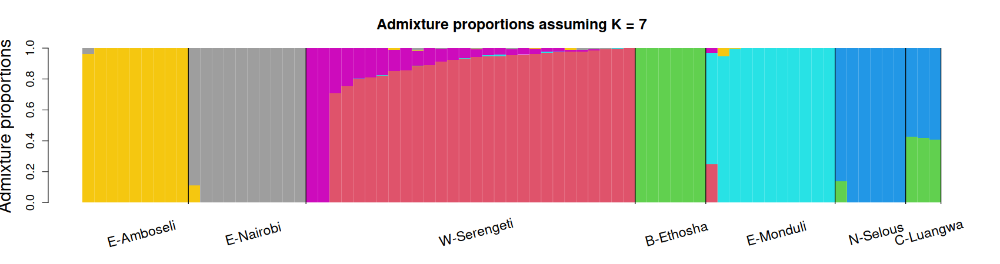
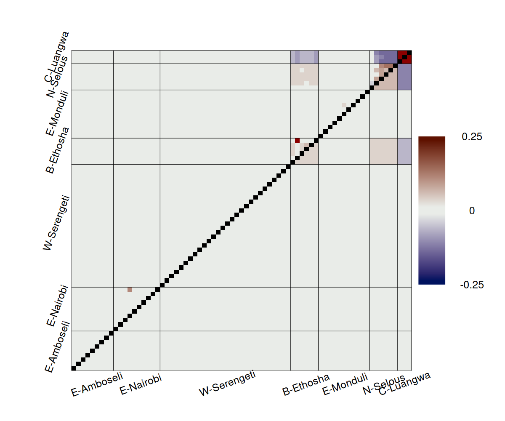
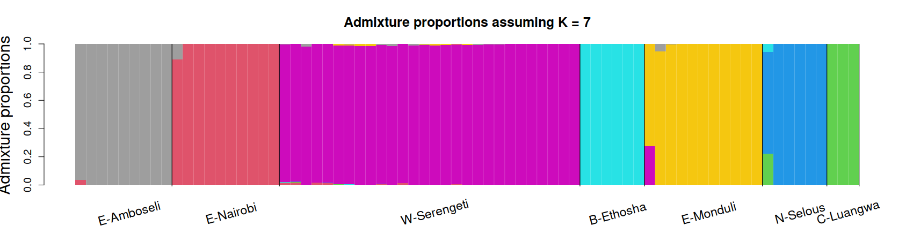
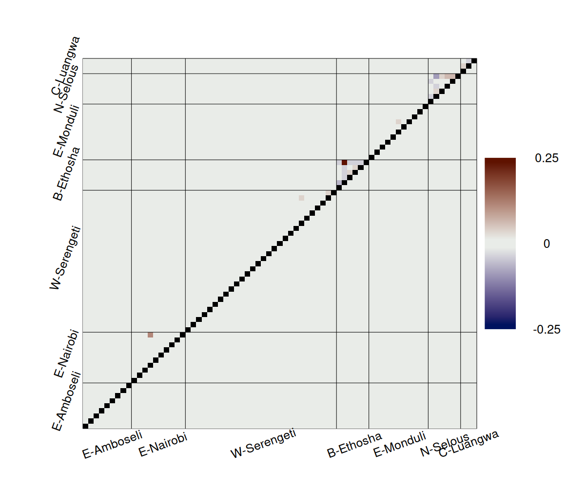
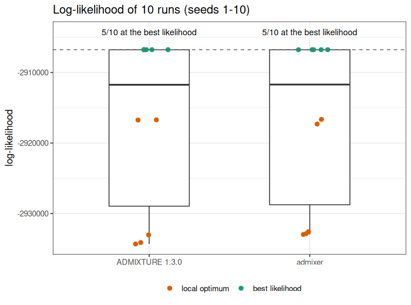
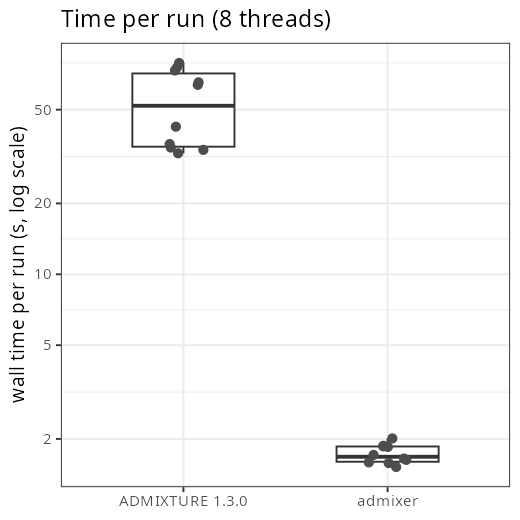

# admixer

Fast maximum-likelihood estimation of ancestry proportions under the ADMIXTURE model, with
ADMIXTURE's command line, input and output. It uses ADMIXTURE's own optimisation algorithm (block
relaxation with Newton steps and quasi-Newton acceleration), evaluated with BLAS matrix products and
started with a mini-batch warm-up. It reaches the same likelihood as ADMIXTURE 1.3.0; in our benchmarks
(20,000 SNPs, 2,000 individuals, K = 5–20, 8 threads) it was 40–90× faster.

## Install

Requires a C++17 compiler with OpenMP (e.g. g++), OpenBLAS and zlib. On Ubuntu/Debian:

```
sudo apt-get install build-essential libopenblas-dev zlib1g-dev
git clone git@github.com:aalbrechtsen/admixer.git
cd admixer
make
```

This builds the `admixer` binary in the current directory. `sudo make install` copies it to
`/usr/local/bin` (or `make install PREFIX=$HOME/.local`). To link a different BLAS, use for example
`make BLAS=-lblis`.

## Usage

```
admixer [options] data.bed K
```

The input is a PLINK binary file set (`data.bed`, `data.bim`, `data.fam`). The output is written to the
working directory, in the same format as ADMIXTURE:

* `data.K.Q`: admixture proportions, one row per individual;
* `data.K.P.gz`: ancestral allele frequencies, one row per SNP (gzip-compressed; `--no-gzip` for `data.K.P`);
* `data.K.corres.txt`: the evalAdmix correlation of residuals between individuals (corrected estimator),
  for checking the model fit; plot it with evalAdmix's `visFuns.R`. It takes a few seconds for thousands of
  individuals but needs about 48 N² bytes of memory, so it is skipped above 20,000 individuals unless
  `--evaladmix` is given.
* `data.K.log`: the log printed to the screen (command line, progress, final log-likelihood).

| option | meaning |
|---|---|
| `-jX`, `-j X` | number of threads (default 8) |
| `--seed=X`, `-s X` | random seed (default 43; `time` uses the clock) |
| `-C=X`, `-C X` | stop when the log-likelihood improves by less than X (default 1e-4) |
| `-o NAME` | output prefix `NAME` instead of `data` |
| `--no-gzip` | write the P matrix uncompressed (`NAME.K.P`) |
| `--supervised` | supervised analysis; reads `data.pop` (one line per individual: a population name, or `-` if unknown). Labelled individuals are held at their population; K must equal the number of population names, and columns follow the order of first appearance in `data.pop` |
| `-P` | projection; reads `data.K.P.in` (or `data.K.P.in.gz`) and estimates Q with P held fixed |
| `--no-evaladmix` | do not compute the evalAdmix correlation of residuals |
| `--evaladmix` | compute it even for more than 20,000 individuals |
| `--conv X` | convergence test with several starts (see below): stop when X runs agree with the best run |
| `-m X`, `--max_runs=X` | with `--conv`: at most X runs (default 10) |
| `--conv_thres=X` | with `--conv`: runs agree if the largest difference in any Q entry is below X (default 0.01) |

Example: `admixer -j16 data.bed 5`

### Convergence test with several starts

Hard data sets can have several local optima, so one run may not find the best solution.
`--conv X` runs admixer with consecutive seeds (`--seed`, `--seed`+1, ...), reading the data only once.
After each run it matches the ancestries of every run to those of the best run so far (highest
log-likelihood), and a run agrees with the best run if the largest difference in any Q entry is below
`--conv_thres`. It stops when X runs (including the best) agree, or after `--max_runs` runs. This is the
Q-matrix criterion of popgenDK's `testQconv.R`, with an exact optimal matching of the ancestries.

The output files are those of the best run. `data.K.conv` lists every run, sorted by log-likelihood (best run first): seed, log-likelihood and its
difference to the best run, the distances to the best run's Q (largest absolute difference, mean
per-individual sum of absolute differences, RMSE), iterations, seconds and whether it agrees.
The log says whether the runs converged.

Example: `admixer --seed=30 --conv 3 data.bed 8` uses seeds 30, 31, 32, ... until 3 runs agree
(at most 10 runs).

## Example: blue wildebeest, K = 7

This example follows the popgenDK exercise
[Admixture proportions from called genotypes: blue wildebeest](https://github.com/popgenDK/courses/blob/main/current_exercises/admixture/admixture_called_genotypes_animal.ipynb).

**The data.** 73 blue wildebeest from seven sampling localities; the locality is the first column of the
`.fam` file.

**How the input was made.** The input `blue_wildebeest_noLD` is made in the exercise from 990,980 called SNPs
(`blue_wildebeest_thin`). The SNPs are LD-pruned with PCAone, which corrects for population structure:

```
PCAone -b blue_wildebeest_thin -k 6 -D -o pcaone
PCAone -B pcaone.residuals -F pcaone.mbim --ld-r2 0.1 --ld-bp 1000000 -o pcaone
plink --bfile blue_wildebeest_thin --extract pcaone.ld.prune.in --make-bed --out blue_wildebeest_noLD --chr-set 29
```

This leaves 37,567 SNPs. The data are not included in this repository.

### One run

```
admixer --seed 1 -j10 -o blue_wildebeest_noLD_admixer blue_wildebeest_noLD.bed 7
```

This run takes 4 seconds and ends at log-likelihood −2932963.07. It writes these files:

| file | size | content |
|---|---|---|
| `blue_wildebeest_noLD_admixer.7.Q` | 4.5 kB | admixture proportions, 73 rows × 7 columns (as ADMIXTURE) |
| `blue_wildebeest_noLD_admixer.7.P.gz` | 0.9 MB | ancestral allele frequencies, 37,567 rows × 7 columns, gzipped (`--no-gzip` for plain text) |
| `blue_wildebeest_noLD_admixer.7.corres.txt` | 50 kB | **evalAdmix correlation of residuals**, 73 × 73, `NA` on the diagonal |
| `blue_wildebeest_noLD_admixer.7.log` | 5 kB | the screen output: command, settings, every iteration, final log-likelihood, optimality check |

The evalAdmix correlations are computed by default, in 0.1 s here. You do not need to run evalAdmix
separately; the file is read directly by evalAdmix's `plotCorRes` (see below). The end of the log:

```
Converged in 11 iterations (3.809 sec)
Loglikelihood: -2932963.069302
Optimality check (max KKT violation): P 7.78e-05 per individual, Q 2.34e-08 per SNP
Writing output files.
evalAdmix correlation of residuals written to blue_wildebeest_noLD_admixer.7.corres.txt (0.11 sec)
Log written to blue_wildebeest_noLD_admixer.7.log
```



The fit looks wrong:
- the W-Serengeti samples are split between two clusters;
- the three C-Luangwa samples all appear admixed in the same proportions.

The evalAdmix correlation of residuals (`blue_wildebeest_noLD_admixer.7.corres.txt`, written by default)
confirms it. There are strong positive correlations within C-Luangwa and N-Selous, and negative correlations
between them and B-Ethosha.



### Several runs with a convergence test

```
admixer --seed 0 -j10 -o blue_wildebeest_noLD_admixerMult blue_wildebeest_noLD.bed 7 --conv 3
```

This tries seeds 0, 1, 2, ... until three runs agree with the best run, in 33 seconds.
`blue_wildebeest_noLD_admixerMult.7.conv` lists the runs, best first:

```
run  seed  loglik           loglik_diff    max_abs_dQ   ...  agrees
9    8     -2906767.495807   0.000000      0                 1
1    0     -2906767.495808  -0.000001      9.53674e-07       1
6    5     -2906767.495820  -0.000013      2.5034e-05        1
8    7     -2932625.706040  -25858.210232  0.99993           0
2    1     -2932817.816830  -26050.321022  0.99993           0
...
```

Three of the nine runs reach the same solution, which is 26,000 log-likelihood units better than the seed-1
run. The output files are those of the best run (seed 8):
- `blue_wildebeest_noLD_admixerMult.7.Q`, `.7.P.gz` and `.7.corres.txt` (evalAdmix computed for the best run);
- `.7.log`, with one summary line per run;
- `blue_wildebeest_noLD_admixerMult.7.conv`, the table above.



Each locality now has its own ancestry, and the residual correlations are close to zero.



The plots were made with evalAdmix's [`visFuns.R`](https://github.com/GenisGE/evalAdmix):

```r
source("https://raw.githubusercontent.com/GenisGE/evalAdmix/master/visFuns.R")
pop <- read.table("blue_wildebeest_noLD.fam")[, 1]
q <- read.table("blue_wildebeest_noLD_admixerMult.7.Q")
ord <- orderInds(pop = pop, q = q)
plotAdmix(q, pop = pop, ord = ord, rotatelab = 15, padj = 0.15, cex.lab = 1.4, col = 2:8)
r <- as.matrix(read.table("blue_wildebeest_noLD_admixerMult.7.corres.txt"))
plotCorRes(r, pop = pop, ord = ord, max_z = 0.25, rotatelabpop = 20, adjlab = 0.05, title = "")
```

### Comparison with ADMIXTURE

Ten runs of each program on the same data (seeds 1–10, K = 7, 8 threads, one run at a time):

```
admixture -j8 -s $seed blue_wildebeest_noLD.bed 7
admixer -j8 -s $seed blue_wildebeest_noLD.bed 7
```



Both programs reach the best likelihood in 5 of the 10 runs. The other runs end in local optima 10,000–27,000
units lower. Over 30 seeds the counts were 18/30 for admixer and 13/30 for ADMIXTURE.

The best runs agree:
- admixer: −2906767.4958 to −2906767.4958;
- ADMIXTURE: −2906767.503 to −2906767.656.

ADMIXTURE's runs are a little lower because its stopping rule ends them slightly before the optimum.



The median time per run is 3.2 s for admixer and 53 s for ADMIXTURE, 17× faster. So `--conv 3` with admixer
(33 s above) takes less time than a single ADMIXTURE run.

## Differences from ADMIXTURE

* Same model, likelihood, parameter bounds, algorithm and stopping rule. Different start: random P,
  near-uniform Q, 5 EM steps, then a mini-batch warm-up.
* Not implemented: cross-validation (`--cv`), bootstrap standard errors (`-B`), penalised estimation
  (`-l`), haploid data, the EM method and the Fst printout. Only PLINK `.bed` input. Note that `-m` is
  admixer's maximum number of runs, not ADMIXTURE's method option.
* Default 8 threads instead of 1; the P matrix is gzip-compressed, the evalAdmix correlation of
  residuals is written by default, and the screen output is also saved to `data.K.log`.
* The log ends with a first-order optimality (KKT) check of the solution.

## Citation

For the model and algorithm: Alexander, Novembre & Lange (2009) *Genome Research* 19:1655–1664.
For the evalAdmix output: Garcia-Erill & Albrechtsen (2020) *Molecular Ecology Resources* 20:936–949, and
van Waaij et al. (2023) *Genetics* 225:iyad157.
