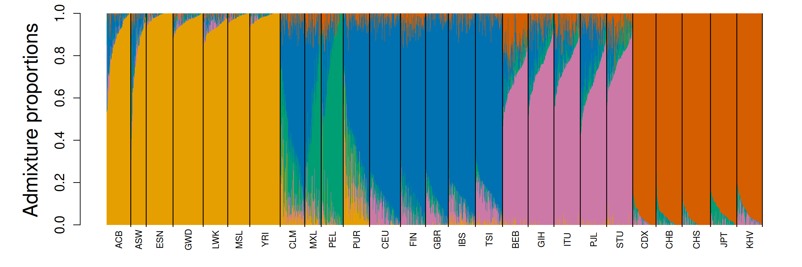
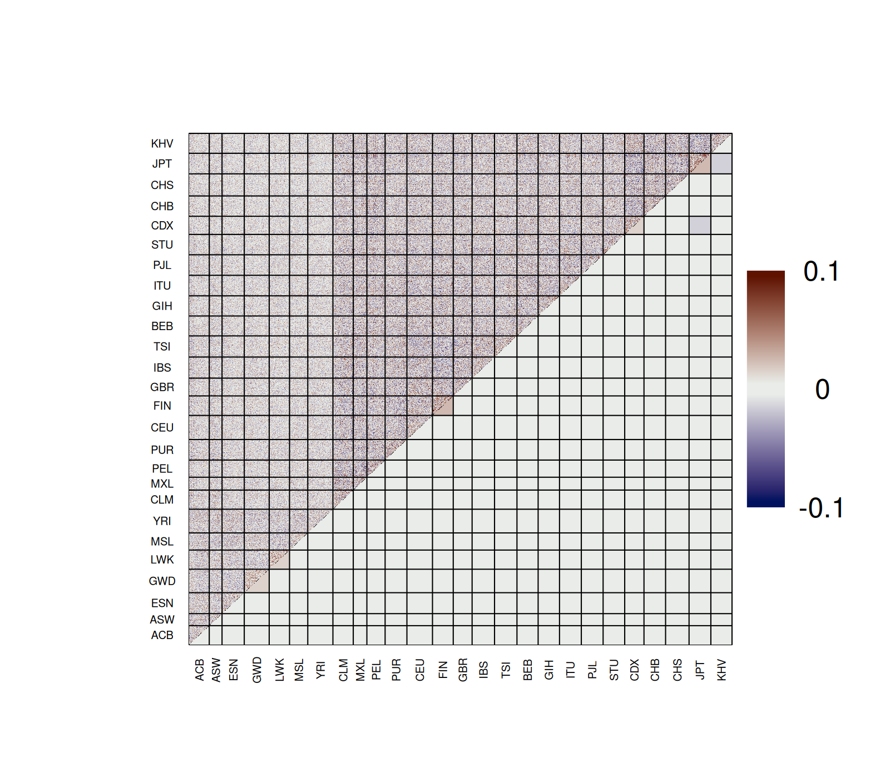
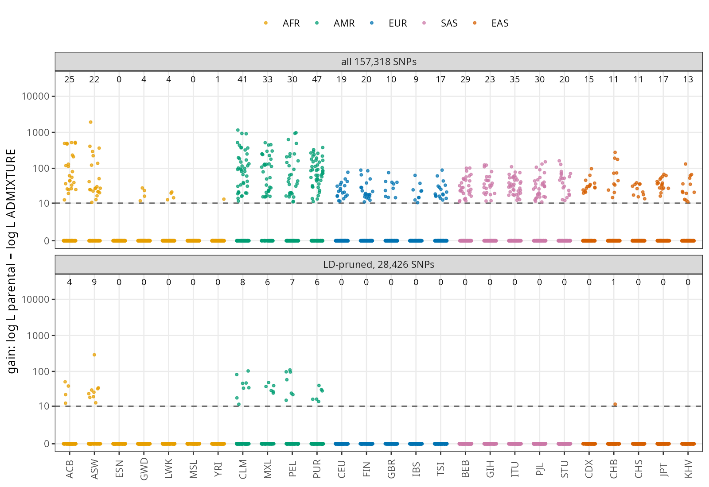
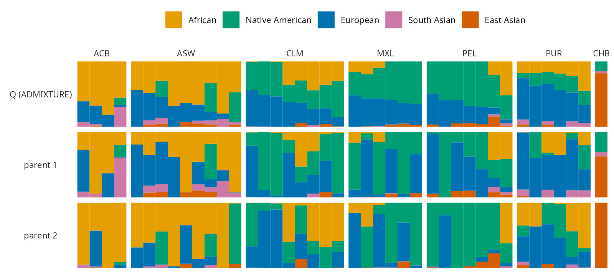
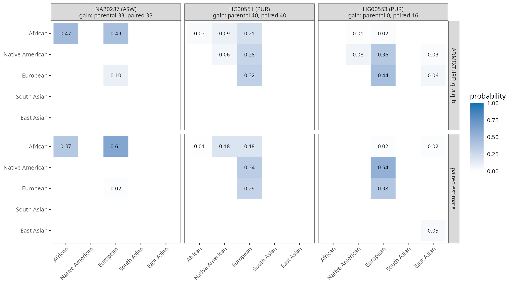

# Using admixer: a worked example

This guide follows one analysis from start to finish:
1. estimate admixture proportions;
2. check the fit;
3. estimate the admixture proportions of each individual's two parents, and the paired ancestry, from the
   finished run.

The data are 1000 Genomes chromosome 20: 2,590 individuals from 26 populations, 157,318 biallelic SNPs with
MAF ≥ 0.05 (high-coverage 2020 release). All times are for 8 threads on a Xeon Gold 6152. The options are
listed in the [README](../README.md#usage); how the methods work is in [DETAILS.md](../DETAILS.md).

## 1. Data

admixer reads PLINK binary files (`.bed` with `.bim` and `.fam`) or genotype likelihoods in beagle format. A
VCF/BCF is converted with plink2:

```
plink2 --bcf chr20.bcf --maf 0.05 --make-bed --out kg
```

For the parental and paired analyses (section 4), the SNPs should be close to independent, so make an
LD-pruned set as well:

```
plink2 --bfile kg --indep-pairwise 50 5 0.5 --out prune
plink2 --bfile kg --extract prune.prune.in --make-bed --out kgp      # 28,426 SNPs
```

## 2. Estimate the admixture proportions

```
admixer kg.bed 5 -j8
```

This takes about 35–50 s and writes:

| file | content |
|---|---|
| `kg.5.Q` | admixture proportions: one row per individual (in `.fam` order), K columns |
| `kg.5.P.gz` | ancestral allele frequencies: one row per SNP (in `.bim` order), K columns |
| `kg.5.corres.txt` | evalAdmix correlation of residuals between individuals, N × N |
| `kg.5.log` | the screen output: settings, every iteration, log-likelihood, optimality check |



The five ancestries correspond to the African, European, South Asian and East Asian populations, and to the
Native American component of the populations from the Americas (MXL, PEL, CLM, PUR). ASW, ACB and the populations
from the Americas are admixed.

The ancestries are not ordered: another seed can give the same solution with the columns permuted. Runs from
different random starts can also end at different optima (local maxima). To run from several starts and keep the
best, use `--conv`:

```
admixer kg.bed 5 -j8 --conv 3        # seeds 43, 44, ... until 3 runs agree with the best (at most 10)
```

## 3. Check the fit

admixer runs evalAdmix by default. `kg.5.corres.txt` holds the correlation of the residuals (observed minus
fitted genotypes) between every pair of individuals. If the model fits, the correlations are close to 0. Plot it
with `plotCorRes` from evalAdmix's [`visFuns.R`](https://github.com/GenisGE/evalAdmix):

```r
source("visFuns.R")
pop <- ...                                    # population of each individual, in .fam order
q <- read.table("kg.5.Q")
ord <- orderInds(pop = pop, q = q)
r <- as.matrix(read.table("kg.5.corres.txt"))
plotCorRes(r, pop = pop, ord = ord, max_z = 0.1, title = "")
```



The plot shows correlations between individuals in the upper triangle and their mean within and between
populations in the lower triangle. They are small throughout. The largest positive means are within JPT, FIN,
LWK, GWD and CDX (0.01–0.03), and the most negative is between JPT and CDX (−0.01). With K = 5 these populations
share an ancestry with their neighbours, and the residuals show the drift each has of its own. Positive residual correlation within
a population means that it shares drift that the model cannot explain. Negative correlation between two groups
means that the model makes them too similar.

## 4. Parental admixture from the finished run

Under the ADMIXTURE model, the ancestry of every allele of an individual is drawn from the same proportions Q.
For an individual whose parents differ in ancestry this is wrong. Take a child of an African and a European
parent: Q = (½ African, ½ European), but at every SNP one allele is African and the other European. The
parental model (that of NGSremix) gives each individual two parents, with proportions x and y, and draws one
allele from each. admixer estimates x and y for each individual with P fixed.

This is not done by default. To compute it from the P and Q of the run you already have, use `--from`:

```
admixer kgp.bed 5 -j8                 # the fit on the LD-pruned SNPs (8 s)
admixer kgp.bed 5 -j8 --from kgp      # reads kgp.5.P.gz and kgp.5.Q, writes kgp.5.parental (0.6 s)
```

`--from PREFIX` does no fit. It reads `PREFIX.K.P.gz` (or `PREFIX.K.P`) and `PREFIX.K.Q`, and writes the
results under the output name (`-o`, by default the input name) with the log in `NAME.K.from.log`. The input
must be the same file as in the earlier run, and for genotype likelihoods the same `--minMaf`/`--minInd`
filters: P has one row per analysed site, and admixer stops if the counts differ. To do the fit and the parental
estimate in one run, add `--parental` instead: `admixer kgp.bed 5 -j8 --parental`.

`kgp.5.parental` has a header and one row per individual:

```
parent1_1 ... parent1_5 parent2_1 ... parent2_5 loglik_parental loglik_admixture
0.000010 0.005180 0.005840 0.988960 0.000010 0.000010 0.005180 0.005840 0.988960 0.000010 -17543.4235 -17543.4235
```

- **Columns.** The first K columns are parent 1 (x), the next K parent 2 (y), then the log-likelihoods of the
  individual under the parental model and under the ADMIXTURE model. The two parents can't be told apart, so
  parent 1 is just the lexicographically larger vector.
- **The gain.** `loglik_parental − loglik_admixture` measures the evidence that the parents differ.
  Without a difference, twice the gain is roughly χ² with K − 1 degrees of freedom.
- **Gains below 10** are reported as 0, with x = y = Q, as in the first row above.
- **Small ancestries.** Ancestries with Q < 0.01 are held at their value.

### LD-prune first

The model assumes independent SNPs. With linked SNPs the same information is counted several times, so the gains
are inflated. The plot shows the gain of every individual. The numbers above each population are the
individuals with a gain above 10, on all SNPs (top) and on the LD-pruned set (bottom):



- **All SNPs:** individuals in every population pass the threshold, including Europeans and East Asians, whose
  parents are not expected to differ in ancestry.
- **LD-pruned:** 40 of the 41 flagged individuals are in the recently admixed populations, ASW, ACB, CLM, MXL,
  PEL and PUR. The exception is a single CHB individual with a gain of 11.

So run the parental analysis on LD-pruned data. If your fit used all SNPs, fit the pruned set as well, as
above; it is fast.

### Reading the parental proportions

The 41 individuals with a gain above 10 (pruned data):



- **ASW and ACB:** typically one parent is mostly African and the other carries most of the European ancestry.
- **CLM, MXL, PEL and PUR:** the parents differ in their European, Native American and African shares.

In all of these individuals, Q equals the average of the two parents to within 0.012, as it should.

## 5. Paired ancestry

`--paired` estimates a more general model: for each individual, the probabilities of the K(K+1)/2 unordered
pairs of ancestries of the two alleles at a SNP. Under the ADMIXTURE model these are q_a² and 2 q_a q_b. Under
the parental model they are x_a y_a and x_a y_b + x_b y_a. Its cost grows as K⁴, so it is only run when asked
for:

```
admixer kgp.bed 5 -j8 --from kgp --paired               # kgp.5.paired only (4 s)
admixer kgp.bed 5 -j8 --from kgp --parental --paired    # both
```

`kgp.5.paired` has the columns `pair_1_1 pair_1_2 ... pair_K_K` (a ≤ b), then `loglik_paired` and
`loglik_admixture`. The plot compares the pair probabilities under ADMIXTURE with the estimates for three
individuals:



- **NA20287 (ASW):** ADMIXTURE expects African/African pairs at 47 % of the SNPs and African/European at 43 %.
  The estimate is 37 % and 61 %, with almost no European/European pairs. That is the signature of a parent with
  little European ancestry.
- **HG00551 (PUR):** the parental gain is 40, and the paired model gains the same, as the parental model
  already explains this individual.
- **HG00553 (PUR):** the parental gain is 0, but the paired gain is 16. The paired model has K(K+1)/2 − 1 = 14
  free parameters, so gains of this size are expected by chance. Compare the paired gain with χ²(14)/2, not with
  the threshold of 10 for the parental model.

## 6. Genotype likelihoods

The same commands work with beagle files. The filters must be the same for the fit and for `--from`:

```
admixer data.beagle.gz 3 -j8 --minMaf=0.05
admixer data.beagle.gz 3 -j8 --minMaf=0.05 --from data --parental --paired
```

## 7. Reading the output in R

```r
q   <- read.table("kgp.5.Q")
par <- read.table("kgp.5.parental", header = TRUE)
gain <- par$loglik_parental - par$loglik_admixture
admixed_parents <- which(gain > 10)
x <- par[, 1:5]; y <- par[, 6:10]               # the two parents
pr <- read.table("kgp.5.paired", header = TRUE)
```

The figures in this guide were made with [`usage_figures.R`](usage_figures.R).
